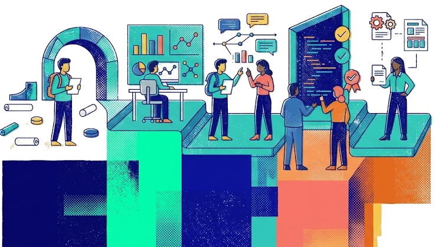
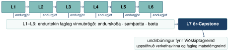
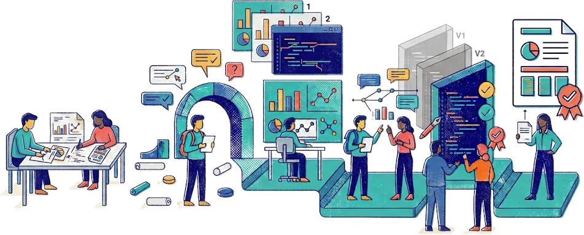



## Áskorunin

Nemendur þurfa að læra að vinna með gögn, greina þau saman og miðla niðurstöðum.

::: {.fa-card cols=3}
- database | **Raungögn** | Spyrja góðra spurninga og vinna með gögn
- code-branch | **Samvinna** | Rýna vinnu og bregðast við endurgjöf
- repeat | **Gæði** | Skjalfesta og gera vinnu endurtakanlega
:::

::: {.lead}
Þetta er samspil tækni, greiningar og samvinnu. Nemendur læra heilt faglegt vinnuferli, ekki aðeins forritun eða eitt greiningartól.
:::

> Hvernig æfa nemendur fagleg vinnubrögð snemma í námi án þess að flækjustigið verði yfirþyrmandi?

**Einfalda þarf inngönguna en halda gæðakröfunum.** Stuðningur er mikill í upphafi og minnkar eftir því sem sjálfstæði eykst.

## Lærdómur úr Viðskiptagreind

:::: {.two-col}
::: {.col}
Nemendur vinna þar með flókin verkefni og raungögn frá samstarfsaðila.

- **Greining:** opnar spurningar og krefjandi gögn
- **Vinnubrögð:** GitHub, pull requests, samvinnurýni og miðlun

**Þau þurftu að læra hvort tveggja samtímis.**
:::

::: {.col}
{width=100% style="max-height: 390px; object-fit: cover; object-position: right center;"}
:::
::::

::: {.lead}
Það varð kveikjan að því að færa grunnvinnubrögðin fyrr í námsleiðina.
:::

Í Upplýsingaverkfræði æfa nemendur sama ferli fyrr með **opnum gögnum**:

::: {.steps}
- Spurningar
- Gögn
- Greining
- Skjalfesting
- Rýni
- Miðlun
:::

## Sex stigvaxandi lotur

{width=72% style="display:block;margin:auto"}

**Sex lotur mynda eitt samhangandi ferli:** sömu grunnvinnubrögð endurtaka sig í nýju samhengi. Umfang eykst, stuðningur minnkar og sjálfstæði vex.

::: {.fa-card cols=3}
- laptop-code | **Rýna vinnuna** | Skýrslur, gögn, kóði, pull requests og jafningjarýni
- comments | **Draga lærdóm** | Kennari greinir sameiginleg mynstur þvert á teymi
- rotate | **Nota strax** | Nemendur nýta endurgjöf í næstu lotu
:::

## Sjöunda lotan: ör-Capstone

Þetta er ekki nýtt verkefni: nemendur vinna markvisst að því í gegnum námskeiðið.

::: {.fa-card cols=3}
- layer-group | **Þróa** | Vinna áfram með verkefnið í lotunum
- comments | **Nýta endurgjöf** | Skerpa greiningu og framsetningu
- arrow-rotate-right | **Skila aftur** | Bæta og skila verkefninu í lokin
:::

::: {.capstone-art style="margin-top: 90px; text-align: center;"}
{height=260}
:::

---

## Pull requests: sýnilegt ferli, faglegt mat

Lokaskýrsla sýnir afurðina. Pull requests sýna tillögu, jafningjarýni, viðbrögð og endurskoðun.

::: {.fa-card cols=3}
- eye | **Sýnileg virkni** | Commits, pull requests og athugasemdir
- list-check | **Gæði vinnubragða** | Afmörkun, skjalfesting og endurtekning
- magnifying-glass-chart | **Gæði greiningar** | Aðferðir, röksemdir og niðurstöður
:::

**Tölulegar GitHub-mælingar**—fjöldi commits, pull requests og athugasemda—eru vísbendingar, ekki einkunnir. Pull requests sýna hluta samstarfsins; fagleg viðmið og dæmi hjálpa nemendum að meta gæði og velja næstu úrbætur.

---

## Hvert viljum við komast?

Upplýsingaverkfræði á að leggja grunn að áframhaldandi þróun faglegra vinnubragða.

::: {.fa-card cols=3}
- chart-line | **Lengra nám** | Opnari og flóknari greiningarverkefni
- handshake | **Starfssamstarf** | Fyrirtæki og stofnanir
- bullhorn | **Fagleg miðlun** | Rýni og niðurstöður fyrir ólíka hagaðila
:::

Markmiðið er ekki aðeins að bæta eitt námskeið. Vinnubrögðin eiga að nýtast í öðrum námskeiðum og síðar í starfi.

Áhrifin þarf að meta kerfisbundið: hvernig nemendur skilja gæði, nýta endurgjöf og yfirfæra vinnubrögðin milli lota og námskeiða.

## {.focus-slide}

::: {.two-col}
::: {.col}
{.contact-photo style="max-height: 520px;"}
:::

::: {.col}
```{=html}
<h2>Takk fyrir</h2>
<h3>Spurningar?</h3>
```


:::
:::
